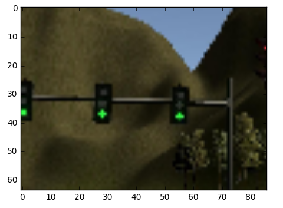
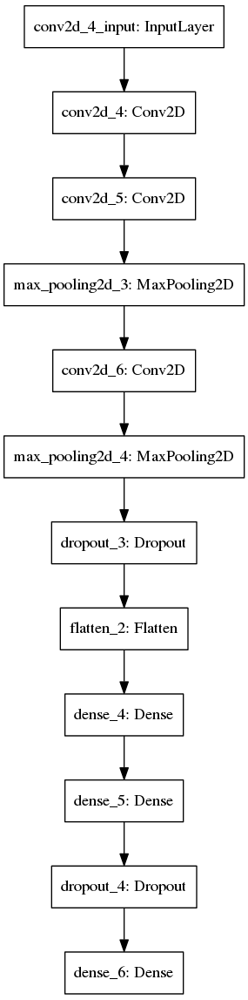

# Udacity Self-Driving Car Nanodegree

## Final Project - System Integration

## Team sdc_capstone_oct17

The System Integration project is the final project of the Udacity Self-Driving Car Nanodegree program. For this project we had to work in groups of up to 5 students. The task was to built ROS nodes to implement the core functionalities of the autonomous vehicle system including control, waypoint following and traffic light detection.

## The Team

### Name
  -  Marlon Rodrigues (Team Lead) Marlon.gerodrigues@gmail.com
  -  Mario Capin (Team Member 1) mario_capin@hotmail.com
  -  Ricardo Guerrero (Team Member 2) ricgu8086@gmail.com
  -  Kofi Baafi (Team Member 3) kbaafi@gmail.com
  -  Kostas Perifanos (Team Member 4) Kostas.perifanos@gmail.com


# Software Architecture

The following is a system architecture diagram showing the ROS nodes and topics used in the project. The ROS nodes and topics shown in the diagram are described briefly in the Code Structure section below.


## Code Structure 
Below is a brief overview of the repo structure, along with descriptions of the ROS nodes. The code that we needed to modify for the project is contained entirely within the (path_to_project_repo)/ros/src/ directory. Within this directory, there are the following ROS packages:
(path_to_project_repo)/ros/src/tl_detector/
This package contains the traffic light detection node: tl_detector.py. This node takes in data from the /image_color, /current_pose, and /base_waypoints topics and publishes the locations to stop for red traffic lights to the /traffic_waypoint topic.
The /current_pose topic provides the vehicle's current position, and /base_waypoints provides a complete list of waypoints the car will be following.
There has to be built both a traffic light detection node and a traffic light classification node. Traffic light detection take place within tl_detector.py, whereas traffic light classification take place within ../tl_detector/light_classification_model/tl_classfier.py.


(path_to_project_repo)/ros/src/waypoint_updater/
This package contains the waypoint updater node: waypoint_updater.py. The purpose of this node is to update the target velocity property of each waypoint based on traffic light and obstacle detection data. This node subscribes to the /base_waypoints, /current_pose, /obstacle_waypoint, and /traffic_waypoint topics, and publish a list of waypoints ahead of the car with target velocities to the /final_waypoints topic.


(path_to_project_repo)/ros/src/twist_controller/
Carla is equipped with a drive-by-wire (dbw) system, meaning the throttle, brake, and steering have electronic control. This package contains the files that are responsible for control of the vehicle: the node dbw_node.py and the file twist_controller.py, along with a pid and lowpass filter that can be used in the implementation. The dbw_nodesubscribes to the /current_velocity topic along with the /twist_cmd topic to receive target linear and angular velocities. Additionally, this node subscribes to /vehicle/dbw_enabled, which indicates if the car is under dbw or driver control. This node publishes throttle, brake, and steering commands to the /vehicle/throttle_cmd, /vehicle/brake_cmd, and /vehicle/steering_cmd topics.


In addition to these packages there can be found the following, which are not necessary to change for the project. The styx and styx_msgs packages are used to provide a link between the simulator and ROS, and to provide custom ROS message types:
- (path_to_project_repo)/ros/src/styx/

  A package that contains a server for communicating with the simulator, and a bridge to translate and publish simulator messages to ROS topics.

- (path_to_project_repo)/ros/src/styx_msgs/
  A package which includes definitions of the custom ROS message types used in the project.

- (path_to_project_repo)/ros/src/waypoint_loader/

  A package which loads the static waypoint data and publishes to /base_waypoints.

- (path_to_project_repo)/ros/src/waypoint_follower/

  A package containing code from Autoware which subscribes to /final_waypoints and publishes target vehicle linear and angular velocities in the form of twist commands to the /twist_cmd topic.


## Subsystem
The subsystem observes the environment of the vehicle and publishes relevant information to other subsystems. The traffic light detection node determines the state of upcoming traffic lights and publishes information to other subsystems.

## Traffic Light Detection and Classification

Training samples were collected from simulator.



The classification model has been created as following:

```python
from __future__ import print_function
import numpy as np
import glob
import pandas as pd
from random import shuffle,seed

# fix random & numpy random seeds for training & shuffling
seed(2017)
np.random.seed(2017)

import tensorflow
import keras
from keras.models import Sequential
from keras.layers import Dense, Dropout, Flatten
from keras.layers import Conv2D, MaxPooling2D
from keras import backend as K
from keras.callbacks import EarlyStopping
%matplotlib inline
import matplotlib.pyplot as plt
from keras.preprocessing.image import ImageDataGenerator
import cv2
WIDTH  = 86
HEIGHT = 64

batch_size = 16
num_classes = 3
epochs = 20

print( tensorflow.__version__,keras.__version__)

def build_train_set():
    dataset = []
    colors = {"red": 0, "yellow":1, "green": 2 }
    for color in colors.keys():
        path = "trainig_set/%s/*.jpg" % color
        print(path)
        images =  glob.glob(path)     
        for im_file in images:
            label = colors[color]
            img = cv2.imread(im_file)
            img = cv2.cvtColor(img, cv2.COLOR_BGR2RGB)
            img = cv2.resize( img, (WIDTH, HEIGHT))
            ## flip image for data augmentation
            img2 = cv2.flip( img.copy(), 1 )

            dataset.append( (np.array(img), label))
            dataset.append( (np.array(img2), label))

            ## augmentation using ImageDataGenerator
            thesh = 15 if label==1 else 8
            i = 0
            for batch in datagen.flow(img.reshape(1,  HEIGHT, WIDTH, 3), batch_size=1):
                i+=1
                dataset.append( (np.array(batch[0]), label) )                
                if i > thesh:
                    break  

    shuffle(dataset)
    return np.array(dataset)


dataset = build_train_set()


r = np.random.rand( dataset.shape[0])
train = dataset[r<.8]
test = dataset[r>=.8]

train.shape, test.shape
x_train = np.array([ img for img in train[:,0]])
y_train = train[:,1]

x_test = np.array([ img for img in test[:,0]])
y_test = test[:,1]

# input image dimensions
img_rows, img_cols = HEIGHT, WIDTH

if K.image_data_format() == 'channels_first':
    input_shape = (3, img_rows, img_cols)
else:
    input_shape = (img_rows, img_cols, 3)

x_train = x_train.astype('float32') / 255
x_test = x_test.astype('float32') / 255

print('x_train shape:', x_train.shape)
print(x_train.shape[0], 'train samples')
print(x_test.shape[0], 'test samples')


es = EarlyStopping(monitor='val_loss', min_delta=0, patience=5, verbose=1, mode='auto')


# convert class vectors to binary class matrices
y_train = keras.utils.to_categorical(y_train, num_classes)
y_test = keras.utils.to_categorical(y_test, num_classes)

model = Sequential()
model.add(Conv2D(32, kernel_size=(3, 3),
                 activation='relu',
                 input_shape=input_shape))

model.add(Conv2D(64, (3, 3), activation='relu'))
model.add(MaxPooling2D(pool_size=(2, 2)))

model.add(Conv2D(128, (3, 3), activation='relu'))
model.add(MaxPooling2D(pool_size=(2, 2)))

model.add(Dropout(0.5))
model.add(Flatten())
model.add(Dense(256, activation='relu'))
model.add(Dense(128, activation='relu'))
model.add(Dropout(0.5))
model.add(Dense(num_classes, activation='softmax'))

model.compile(loss=keras.losses.categorical_crossentropy,
              optimizer=keras.optimizers.Adadelta(),
              metrics=['accuracy'])

model.fit(x_train, y_train,
          batch_size=batch_size,
          epochs=epochs,
          verbose=1,
          validation_data=(x_test, y_test),
          callbacks =[es]
         )
score = model.evaluate(x_test, y_test, verbose=0)
print('Test loss:', score[0])
print('Test accuracy:', score[1])

model.save("model_6_keep_aspect_ratio.hd5")

```


### Model training output:

```shell
926 train samples
226 test samples
Train on 926 samples, validate on 226 samples
Epoch 1/20
926/926 [==============================] - 32s - loss: 0.9668 - acc: 0.5508 - val_loss: 0.8353 - val_acc: 0.5929
Epoch 2/20
926/926 [==============================] - 32s - loss: 0.7857 - acc: 0.6598 - val_loss: 0.6687 - val_acc: 0.5575
Epoch 3/20
926/926 [==============================] - 33s - loss: 0.4540 - acc: 0.8348 - val_loss: 0.2827 - val_acc: 0.8850
Epoch 4/20
926/926 [==============================] - 33s - loss: 0.2168 - acc: 0.9320 - val_loss: 0.1376 - val_acc: 0.9779
Epoch 5/20
926/926 [==============================] - 33s - loss: 0.0827 - acc: 0.9741 - val_loss: 0.0639 - val_acc: 0.9735
Epoch 6/20
926/926 [==============================] - 35s - loss: 0.0495 - acc: 0.9860 - val_loss: 0.0324 - val_acc: 0.9867
Epoch 7/20
926/926 [==============================] - 40s - loss: 0.0283 - acc: 0.9935 - val_loss: 0.0212 - val_acc: 0.9912
Epoch 8/20
926/926 [==============================] - 38s - loss: 0.0174 - acc: 0.9935 - val_loss: 0.0122 - val_acc: 1.0000
Epoch 9/20
926/926 [==============================] - 38s - loss: 0.0141 - acc: 0.9968 - val_loss: 0.0083 - val_acc: 1.0000
Epoch 10/20
926/926 [==============================] - 36s - loss: 0.0080 - acc: 0.9978 - val_loss: 0.0102 - val_acc: 0.9956
Epoch 11/20
926/926 [==============================] - 32s - loss: 0.0104 - acc: 0.9978 - val_loss: 0.0071 - val_acc: 1.0000
Epoch 12/20
926/926 [==============================] - 31s - loss: 0.0086 - acc: 0.9978 - val_loss: 0.0081 - val_acc: 0.9956
Epoch 13/20
926/926 [==============================] - 30s - loss: 0.0022 - acc: 1.0000 - val_loss: 0.0114 - val_acc: 0.9956
Epoch 14/20
926/926 [==============================] - 30s - loss: 0.0020 - acc: 1.0000 - val_loss: 0.0101 - val_acc: 0.9912
Epoch 15/20
926/926 [==============================] - 31s - loss: 0.0043 - acc: 0.9989 - val_loss: 0.0049 - val_acc: 0.9956
Epoch 16/20
926/926 [==============================] - 30s - loss: 9.8620e-04 - acc: 1.0000 - val_loss: 0.0088 - val_acc: 0.9956
Epoch 17/20
926/926 [==============================] - 33s - loss: 0.0012 - acc: 1.0000 - val_loss: 0.0052 - val_acc: 0.9956
Epoch 18/20
926/926 [==============================] - 33s - loss: 4.5056e-04 - acc: 1.0000 - val_loss: 0.0030 - val_acc: 1.0000
Epoch 19/20
926/926 [==============================] - 38s - loss: 0.0043 - acc: 0.9978 - val_loss: 0.0039 - val_acc: 1.0000
Epoch 20/20
926/926 [==============================] - 36s - loss: 5.0373e-04 - acc: 1.0000 - val_loss: 0.0061 - val_acc: 0.9956
Test loss: 0.00606627860138
Test accuracy: 0.995575221239
```




### Waypoint Following

The vehicle’s path is based on the vehicle’s current position and will be passed to the control subsystem.


###  Waypoint Loader Node
This node loads a flat file that contains the waypoints and publishes them to /base_waypoints.


### Waypoint Updater Node

The path planning is done within this node and gets the list of waypoints, the vehicle’s current position, and the state of upcoming traffic lights. This node publishes a list of waypoints which contains a position and a target velocity. If the vehicle changes its position, there has to be planned a new path.


## Control

This subsystem publishes control commands for the vehicle’s steering, throttle, and brakes based on the waypoints.

### Waypoint Follower Node

This node parses the list of waypoints to follow and publishes velocities.


### DBW Node (Drive By Wire)
The DBW node, the final node in the system, adjusts the vehicle’s control (throttle, steering, brake).
Throttle Controller
The throttle controller compares the current and target velocites and adjusts the throttle.

### Steering Controller
The steering controller translates the velocities into a steering angle.

### Braking Controller
The braking controller take account brake actions based on the difference in the vehicle’s current velocity and the proposed velocity.


## Usage and Testing on Simulator


1. Clone the project repository
```sh
git clone https://github.com/udacity/CarND-Capstone.git

```
2. Install python dependencies

```sh
cd CarND-Capstone
pip install -r requirements.txt
```
3. Make and run styx

```sh
cd ros
catkin_make
source devel/setup.sh
roslaunch launch/styx.launch
```
4. Run the simulator


## Appendix

### Troubleshooting simulator issues


Simulator issues were reduced by increasing the number of cores and memory available to the VM (4 gpu cores &  12gb RAM )
